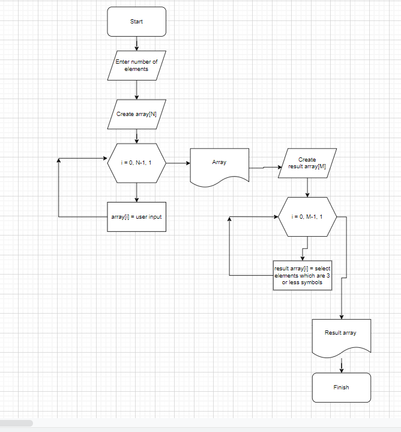

# Итоговая проверочная работа

## Поставленная задача
Написать программу, которая из имеющегося массива строк формирует массив из строк, длинна которыйх меньше либо равна 3 символа. Первоначальный массив можно ввести с клавиатуры, либо задать на старте выполнения алгоритма. при решении не рекомендуется пользоватья коллекциями, лучше обойтись исключительно массивами.

## Алгоритм решения задачи
1. Пользователь вводит желаемое количество элементов;
2. Пользователь вводит элементы массива;
3. Исходный массив выводится в консоль;
3. Отбираются элементы, длина которых меньше или равна 3;
5. Результирующий массив выводится на экран.

## Ссылка на репозиторий проекта
Для перехода в репозиторий проекта, нажмите сюда: [Проект](https://github.com/Chernakov96/Semester-project)

## Блок схема
Ниже представлена схема работы алгоритма
